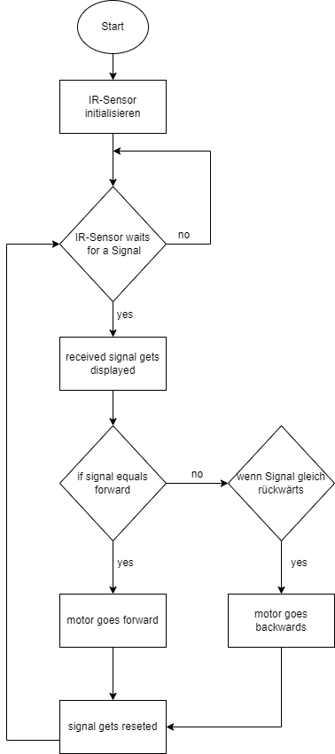
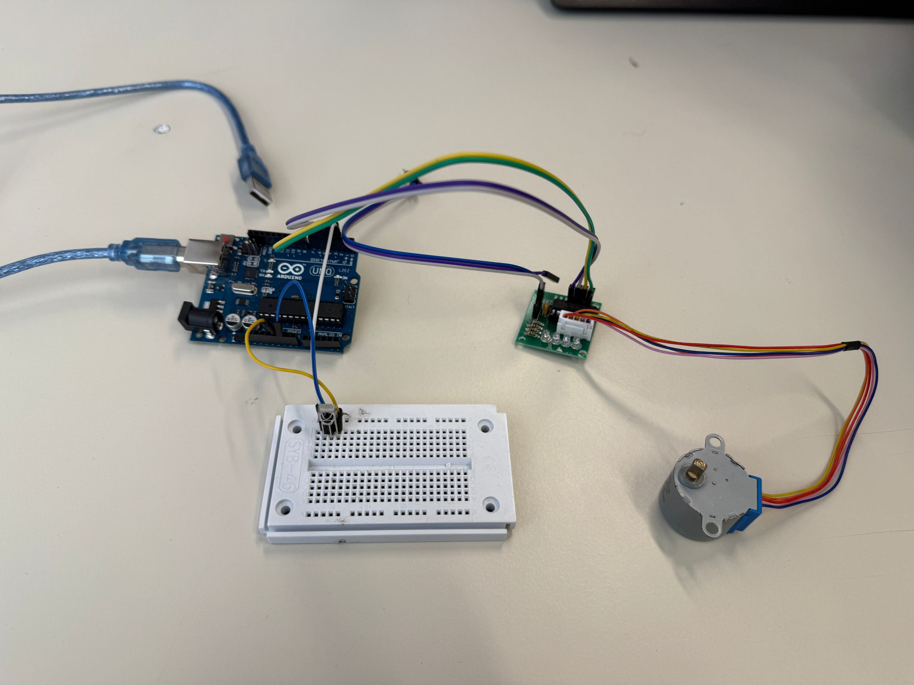

# Motorsteuerung-mit-IR-Sensor

## Description

This project demonstrates how to control a 28BYJ-48 4-Phase Stepper Motor using an IR sensor and a remote control. The system allows for remote operation of the motor, making it useful for applications such as automation and robotics.

*What did I learn?*

- Programming an Arduino with an IR-Sensor and IR-Remote
- Controlling a stepper motor with an ULN2003 driver board

## Table of Contents

  - [Description](#description)
  - [Table of Contents](#table-of-contents)
  - [Circuit Diagram](#circuit-diagram)
  - [Flow Chart](#flow-chart)
  - [Project picture](#project-picture)
  - [Bill of materials](#bill-of-materials)

## Flow Chart

The flowchart outlines the reaction game process:

## Project picture

The real-life breadboard setup corresponds to the circuit diagram. It includes:

## Bill of materials

- IR-Sensor
- IR-Remote
- ULN2003
- stepper motor 28byj-48 
- Arduino Uno