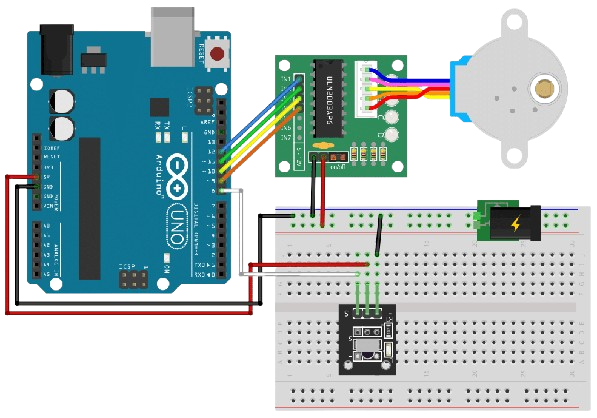

# Motorsteuerung-mit-IR-Sensor

## Description

This project demonstrates how to control a 28BYJ-48 4-Phase Stepper Motor using an IR sensor and a remote control. The system allows for remote operation of the motor, making it useful for applications such as automation and robotics.

*What did I learn?*

- Programming an Arduino with an IR-Sensor and IR-Remote
- Controlling a stepper motor with an ULN2003 driver board

## Table of Contents

  - [Description](#description)
  - [Table of Contents](#table-of-contents)
  - [Installation](#installation)
  - [Circuit Diagram](#circuit-diagram)
  - [Flow Chart](#flow-chart)
  - [Project picture](#project-picture)
  - [Bill of materials](#bill-of-materials)

## Installation

1. Download and Install Arduino IDE

2. Download the Arduino IDE from the official website: https://www.arduino.cc/en/software
Install the software on your computer.
Install Arduino Drivers (if needed)

3. Connect the Arduino to your PC via USB.
If the board is not recognized, install the necessary drivers (e.g., for CH340 or ATmega).
Add Required Libraries

4. Open the Arduino IDE and go to Sketch → Include Library → Manage Libraries.
Install the following libraries (if required):
LiquidCrystal (for the LCD display).
Assemble the Circuit

5. Connect the LED, buzzer, LCD display, and buttons to the Arduino according to the circuit diagram.
Ensure correct wiring of all components.
Upload the Code

6. Open the source code in the Arduino IDE.
Select the correct board under Tools → Board.
Select the correct COM port under Tools → Port.
Click Upload to transfer the code to the Arduino.
Test the Game

After uploading, the reaction game starts automatically.
Follow the instructions on the LCD screen and test your reaction time!

## Circuit Diagram

The circuit diagram shows the wiring of an Arduino Uno with essential components for the reaction game. 

## Flow Chart

The flowchart outlines the reaction game process:

## Project picture

The real-life breadboard setup corresponds to the circuit diagram. It includes:

## Bill of materials

- IR-Sensor
- IR-Remote
- ULN2003
- stepper motor 28byj-48 
- Arduino Uno